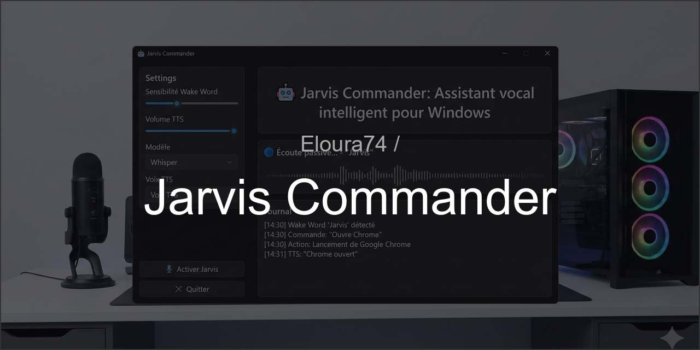

<div align="center">
  
</div>
<br>

# 🤖 Jarvis Commander

**Assistant vocal intelligent pour Windows** avec reconnaissance vocale locale, détection de wake word, et contrôle système complet.

---

## 📋 Table des matières

- [Fonctionnalités](#-fonctionnalités)
- [Prérequis](#-prérequis)
- [Installation](#-installation)
- [Configuration](#️-configuration)
- [Utilisation](#-utilisation)
- [Commandes vocales](#-commandes-vocales-supportées)
- [Architecture](#-architecture)
- [Optimisation audio](#-optimisation-audio-nvidia-broadcast)
- [Dépannage](#-dépannage)
- [Personnalisation](#-personnalisation)

---

## ✨ Fonctionnalités

### 🎯 Wake Word Detection
- Détection locale du mot-clé **"jarvis"** via Picovoice Porcupine
- Faible latence, fonctionne en arrière-plan
- Sensibilité réglable

### 🎤 Reconnaissance vocale (STT)
- Transcription locale avec **Whisper** (OpenAI)
- Support GPU CUDA pour accélération (RTX 3060)
- Modèles multiples : tiny, base, small, medium, large
- Filtrage automatique des silences

### 🔊 Synthèse vocale (TTS)
- TTS locale avec **pyttsx3**
- Voix françaises
- Vitesse et volume réglables

### 🎮 Actions système
- **Ouverture/fermeture d'applications** (Chrome, Discord, Bambu Studio, etc.)
- **Contrôle clavier/souris** (scroll, dictée)
- **Recherche web** automatique
- **Recherche de fichiers** sur les disques
- **Fermeture de fenêtres** actives

### 🖥️ Interface graphique moderne
- Interface PySide6/Qt avec thème sombre
- Journal en temps réel des commandes
- Panneau de paramètres
- Indicateurs d'état visuels

---

## 🔧 Prérequis

### Matériel recommandé
- **OS** : Windows 10/11
- **GPU** : NVIDIA RTX (pour accélération Whisper CUDA) - optionnel
- **Micro** : Micro USB de qualité (ex: GXTrust)
- **RAM** : 8 Go minimum, 16 Go recommandé

### Logiciels requis
- **Python** : 3.10 ou 3.12 (recommandé)
- **Visual Studio Code** ou autre IDE
- **Git** (optionnel)

### Compte Picovoice (gratuit)
- Créer un compte sur [https://console.picovoice.ai/](https://console.picovoice.ai/)
- Obtenir une clé API gratuite (nécessaire pour le wake word)

---

## 📦 Installation

### 1. Cloner ou créer le projet

Si vous avez les fichiers, placez-les dans `A:\Dev\Jarvis_Commander`.

```bash
cd A:\Dev\Jarvis_Commander
```

### 2. Créer un environnement virtuel

```bash
# Créer l'environnement virtuel
python -m venv venv

# Activer l'environnement
.\venv\Scripts\activate
```

Vous devriez voir `(venv)` apparaître dans votre terminal.

### 3. Installer les dépendances

```bash
pip install --upgrade pip
pip install -r requirements.txt
```

**Note CUDA** : Si vous avez une carte NVIDIA et souhaitez utiliser l'accélération GPU pour Whisper, installez PyTorch avec CUDA :

```bash
pip install torch torchvision torchaudio --index-url https://download.pytorch.org/whl/cu118
```

### 4. Vérifier l'installation

```bash
python -c "import pvporcupine; import faster_whisper; import pyttsx3; print('✅ Toutes les dépendances sont installées')"
```

---

## ⚙️ Configuration

### 1. Configurer la clé API Picovoice

Ouvrez `config/config.yaml` et modifiez :

```yaml
wake_word:
  access_key: "VOTRE_CLE_API_PICOVOICE_ICI"  # ← Remplacez par votre clé
  sensitivity: 0.7
```

### 2. Configurer les applications

Ajoutez ou modifiez les chemins des applications dans `config/config.yaml` :

```yaml
applications:
  chrome: "C:\\Program Files\\Google\\Chrome\\Application\\chrome.exe"
  bambu_studio: "C:\\Program Files\\BambuStudio\\BambuStudio.exe"
  # ... ajoutez vos applications
```

**💡 Astuce** : Pour trouver le chemin d'une application :
1. Clic droit sur le raccourci
2. Propriétés → Cible
3. Copiez le chemin complet

### 3. Configurer le micro (optionnel)

Par défaut, Jarvis utilise le micro système par défaut. Pour spécifier un micro :

```python
# Lister les périphériques audio disponibles
python -c "import sounddevice as sd; print(sd.query_devices())"
```

Notez l'index de votre micro et ajoutez dans `config/config.yaml` :

```yaml
audio:
  input_device_index: 2  # Remplacez par l'index de votre micro
```

---

## 🚀 Utilisation

### Lancer Jarvis

```bash
# Assurez-vous que l'environnement virtuel est activé
.\venv\Scripts\activate

# Lancer Jarvis
python main.py
```

### Workflow typique

1. **Fenêtre Jarvis s'ouvre**
2. Cliquez sur **"🎤 Activer Jarvis"**
3. L'indicateur passe à **"🔵 Écoute passive..."**
4. Dites **"Jarvis"** (wake word)
5. Jarvis répond **"Oui ?"**
6. Dites votre commande (ex: **"Ouvre Chrome"**)
7. Jarvis exécute l'action et confirme vocalement

### Interface

- **Onglet Journal** : Historique de toutes les commandes et actions
- **Onglet Paramètres** : Réglages de sensibilité, vitesse TTS, modèle Whisper
- **Bouton Activer/Désactiver** : Contrôle manuel de l'écoute
- **Bouton Quitter** : Ferme proprement Jarvis

---

## 🗣️ Commandes vocales supportées

### Ouverture d'applications

```
"Jarvis, ouvre Chrome"
"Jarvis, lance Discord"
"Jarvis, démarre Bambu Studio"
"Jarvis, exécute Fusion 360"
```

### Fermeture d'applications

```
"Jarvis, ferme Chrome"
"Jarvis, quitte Discord"
"Jarvis, arrête Bambu Studio"
```

### Recherche web

```
"Jarvis, recherche impression 3D résine"
"Jarvis, fais une recherche web sur les servo moteurs"
"Jarvis, google Python tutoriel"
```

### Contrôle de navigation

```
"Jarvis, scroll vers le bas"
"Jarvis, descends"
"Jarvis, scroll vers le haut"
"Jarvis, remonte"
```

### Dictée de texte

```
"Jarvis, dicte Bonjour tout le monde"
"Jarvis, écris ceci est un test"
"Jarvis, tape Hello World"
```

### Recherche de fichiers

```
"Jarvis, recherche sur le disque A les fichiers .stl"
"Jarvis, cherche robot sur le disque C"
"Jarvis, trouve les fichiers .py sur mon disque"
```

### Fermeture de fenêtre

```
"Jarvis, ferme la fenêtre active"
```

---

## 🏗️ Architecture

```
Jarvis_Commander/
├── main.py                    # 🚀 Point d'entrée, orchestration
├── requirements.txt           # 📦 Dépendances Python
├── README.md                  # 📖 Documentation
│
├── config/
│   └── config.yaml           # ⚙️ Configuration centralisée
│
├── audio/
│   ├── wake_word.py          # 🎯 Détection "jarvis" (Porcupine)
│   ├── stt.py                # 🎤 Speech-to-Text (Whisper)
│   └── tts.py                # 🔊 Text-to-Speech (pyttsx3)
│
├── nlu/
│   └── intent_parser.py      # 🧠 Analyse d'intentions (règles)
│
├── actions/
│   └── system_control.py     # 🎮 Actions Windows (apps, scroll, etc.)
│
├── ui/
│   └── main_window.py        # 🖥️ Interface Qt/PySide6
│
└── logs/                      # 📝 Logs datés (créés auto)
    └── jarvis_YYYYMMDD.log
```

### Flux d'exécution

```
[Micro] → [Wake Word Detector] → Wake word "jarvis" détecté
                                        ↓
                        [TTS: "Oui ?"] + [Enregistrement audio]
                                        ↓
                              [STT: Whisper] → Texte transcrit
                                        ↓
                            [Intent Parser] → {intent, params}
                                        ↓
                           [System Controller] → Action exécutée
                                        ↓
                            [TTS: Confirmation] + [Log UI]
```

---

## 🎧 Optimisation audio (NVIDIA Broadcast)

Si vous avez une carte NVIDIA RTX, utilisez **NVIDIA Broadcast** pour filtrer le bruit ambiant et l'écho du film.

### Installation

1. Téléchargez [NVIDIA Broadcast](https://www.nvidia.com/fr-fr/geforce/broadcasting/broadcast-app/)
2. Installez et lancez l'application
3. Activez **"Suppression du bruit"** et **"Suppression de l'écho"**

### Configuration Windows

1. **Paramètres Windows** → **Système** → **Son**
2. Dans **Entrée**, sélectionnez :
   - **"Microphone (NVIDIA Broadcast)"** au lieu de votre micro physique
3. Testez le niveau sonore

### Résultat

Jarvis écoutera uniquement votre voix, même avec :
- Un film qui tourne en fond
- Musique ambiante
- Bruits de clavier

---

## 🐛 Dépannage

### Problème : "Clé API Picovoice invalide"

**Solution** :
1. Vérifiez que vous avez copié la clé complète depuis [console.picovoice.ai](https://console.picovoice.ai/)
2. Collez-la dans `config/config.yaml` → `wake_word.access_key`
3. Relancez Jarvis

### Problème : "Modèle Whisper trop lent"

**Solutions** :
1. Utilisez un modèle plus petit : `tiny` ou `base`
2. Vérifiez que CUDA est installé (pour GPU)
3. Dans `config.yaml`, changez `model: "small"` → `model: "tiny"`

### Problème : "Wake word non détecté"

**Solutions** :
1. Augmentez la sensibilité dans Paramètres (0.8 ou 0.9)
2. Parlez plus fort et distinctement
3. Vérifiez que le bon micro est sélectionné
4. Testez le niveau du micro dans Windows

### Problème : "Application non trouvée"

**Solution** :
1. Vérifiez le chemin dans `config/config.yaml`
2. Assurez-vous que `%USERNAME%` est bien écrit si utilisé
3. Testez le chemin manuellement dans l'explorateur

### Problème : "Pas de son TTS"

**Solutions** :
1. Vérifiez que vos haut-parleurs sont allumés
2. Augmentez le volume dans Paramètres Jarvis
3. Vérifiez que pyttsx3 a accès au périphérique de sortie

---

## 🎨 Personnalisation

### Ajouter une nouvelle application

Éditez `config/config.yaml` :

```yaml
applications:
  mon_app: "C:\\Chemin\\Vers\\MonApp.exe"
```

Puis dites : **"Jarvis, ouvre mon app"**

### Ajouter un alias

```yaml
app_aliases:
  navigateur: chrome
  calculatrice: calculator
  mon_code: vscode
```

Maintenant vous pouvez dire : **"Jarvis, ouvre navigateur"** au lieu de **"ouvre chrome"**.

### Modifier les patterns d'intentions

Ouvrez `nlu/intent_parser.py` et ajoutez vos propres patterns :

```python
self.patterns = {
    'open_app': [
        r'(?:ouvre|lance|démarre)\s+(.+)',
        r'active\s+(.+)',  # ← Nouveau pattern
    ],
    # ...
}
```

### Créer une nouvelle action

1. Ajoutez une fonction dans `actions/system_control.py`
2. Ajoutez un pattern dans `nlu/intent_parser.py`
3. Gérez l'action dans `main.py` → `_execute_action()`

**Exemple** : Ajouter une action "verrouiller l'écran"

```python
# Dans system_control.py
def lock_screen(self) -> bool:
    try:
        subprocess.run(['rundll32.exe', 'user32.dll,LockWorkStation'])
        return True
    except:
        return False

# Dans intent_parser.py
'lock_screen': [
    r'(?:verrouille|bloque|lock)\s+(?:l\')?(?:écran|ordinateur|pc)',
],

# Dans main.py → _execute_action()
elif intent == 'lock_screen':
    success = self.system_controller.lock_screen()
    response = "Verrouillage" if success else "Erreur"
```

---

## 📝 Notes importantes

### Respect de la vie privée
- **100% local** : Aucune donnée n'est envoyée sur Internet
- Whisper, Porcupine et pyttsx3 fonctionnent entièrement hors ligne
- Seule exception : recherche web (ouvre Google dans le navigateur)

### Performance
- **Latence wake word** : ~100ms
- **Latence STT (small)** : 1-3 secondes selon longueur audio
- **Latence TTS** : Quasi-instantanée

### Limitations
- Reconnait uniquement le français (configurable)
- NLU basique (règles, pas d'IA conversationnelle)
- Nécessite une prononciation claire

---

## 🚀 Améliorations futures possibles

- [ ] Intégration GPT pour réponses conversationnelles
- [ ] Support multi-langues
- [ ] Historique des commandes persistant
- [ ] Mode "toujours à l'écoute" avec VAD
- [ ] Reconnaissance de locuteurs
- [ ] Plugin system pour actions personnalisées
- [ ] Mode serveur (contrôle à distance)
- [ ] Support macOS et Linux

---

## 📄 Licence

Projet personnel - Libre d'utilisation et de modification.

---

## 🙏 Crédits

- **Whisper** : OpenAI ([github.com/openai/whisper](https://github.com/openai/whisper))
- **Porcupine** : Picovoice ([picovoice.ai](https://picovoice.ai/))
- **pyttsx3** : [github.com/nateshmbhat/pyttsx3](https://github.com/nateshmbhat/pyttsx3)
- **PySide6** : Qt Company ([qt.io](https://www.qt.io/))

---

## 💬 Support

Pour toute question ou problème, consultez :
- Les logs dans `logs/jarvis_YYYYMMDD.log`
- L'onglet Journal dans l'interface
- La documentation des librairies utilisées

---

**Bon usage de Jarvis Commander ! 🤖✨**
